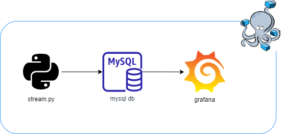

# TP_final
TP Final para Administración de Sistemas GNU/Linux y Virtualización Avanzada

El proyecto consiste en una app que corre sobre python. Comienza con un script que genera datos en tiempo real entre cierto rango, y arroja datos anómalos que salen del mismo.
Todos estos datos generados por la app, son guardados en una base de datos mySQL, y luego son mostrados mediante graficos en la aplicación Grafana.

Los programas son iniciados con docker-compose (con imagenes oficiales de dockerhub).

## Arquitectura de la app

En el siguiente diagrama, se puede observar la arquitectura a alto nivel utilizada

